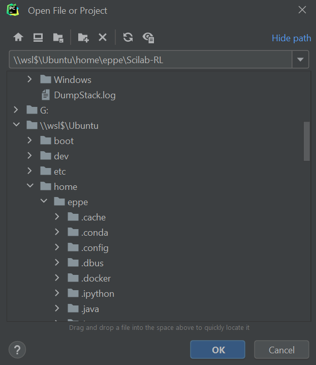
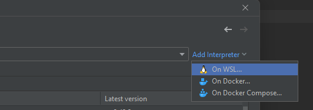
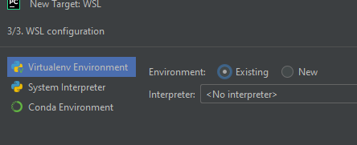
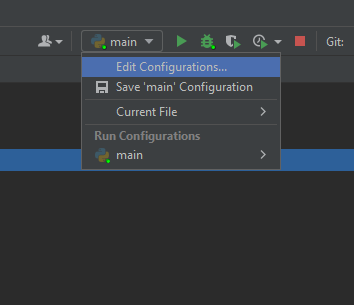
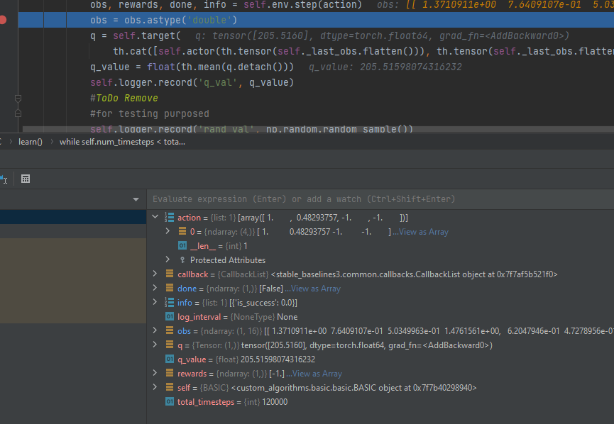

These instructions work for Windows 11, Linux and Mac Systems. The framework should run on most Unix-based systems, but we highly recommend Ubuntu 22. We highly recommend not using a virtual machine. A PC with a dedicated NVIDIA Graphics card is beneficial but not required, the framework also runs on a decent (not too old) laptop. 

# Detailed Instructions

1. [Required on Windows systems only] Install Ubuntu 22 LTS via WSL
* Install Ubuntu from the Microsoft Store. Just search for Ubuntu and get Ubuntu 22 LTS. Alternatively, you can install it via Powershell, following these instructions: https://www.c-sharpcorner.com/article/how-to-install-windows-subsystem-for-linux-wsl2-on-windows-11/
* The Ubuntu version that you get when using Windows 10 will probably not work, because Windows 10 uses WSL 1 and not WSL 2. You can make it work if you update from WSL 1 to WSL 2 manually, but it will be painful. Windows 10 is not recommended, we will not be able to provide you with any further assistance if you use Windows 10. Use Windows 11 instead.

2. Prepare Linux Installation
* [Windows] Start the WSL2 console (E.g. start Ubuntu from the start menu, or open a Powershell and run `wsl`) 
* [Native Ubuntu] Open a terminal window
* Update the apt repository: `sudo apt update`
* Install gcc and other tools: `sudo apt install libosmesa6-dev libgl1-mesa-glx libglfw3 patchelf gcc ffmpeg`

3. Clone this repository 
* Clone this repository by navigating to your home folder in the Ubuntu WSL2 console and running `git clone https://collaborating.tuhh.de/ckv0173/Scilab-RL.git`. This creates a folder `Scilab-RL`.

4. Install the main Scilab-RL dependencies
* In the Ubuntu console, navigate to the Scilab-RL folder , e.g., `cd Scilab-RL`. From there, run `./setup.sh`. This will install all required dependencies, it will take a while. 

5. Create an weights n biases account 
* Go to [wandb.ai]([wandb.ai) and create an account. If you are affiliated with a research institution or university, you should use that email address to get a free educational account. 

6. Test the installation from the Linux console
* Activate Conda by running `source ~/.bashrc`
* Activate the correct Conda environment with `conda activate scilabrl`
* run `python src/main.py`
* When running for the first time, you are asked about your wandb account. On your wandb profile site at [wandb.ai]([wandb.ai), go to "settings" and copy your API key. Then paste it in the console. 
* Also, when running for the first time, MuJoCo is being compiled, and gcc will produce some additional output. 
* Once compilation is finished, you should see console output similar to the following: 

7. Accessing visualizations and debugging information. 
* By default, Scilab-RL will store all data of the currently running experiment in the `data` subfolder. The structure is <Scilab-Rl-root>/data/<git commit hash>/<Environment name>/<Time of Day>. There, you will  also find a subfolder "videos" with renderings of the experiment. 
* To monitor all other training metrics, go to wandb.ai and find your experiment data there. 

9. [Optional] Test real-time rendering
* To test the real-time rendering, start `python src/main.py source render=display`. 
* [Windows] You cannot do real-time rendering on Windows  because then you would need to install an X-Server first and export the $DISPLAY variable appropriately. If you want that, it is necessary to install an X-Server on Windows. We recommend using the free version of [VcxSrv](https://sourceforge.net/projects/vcxsrv/). Download and install it. Start the X-Server with `XLaunch` (cf. the shortcut on your Windows Desktop). Then press "Next->Next", and in the "Extra Settings" dialog make sure to select "Disable access control". Press "Next->Finish". There are some other details that we leave unspecified here for now. Generally, we recommend not using real-time rendering on Windows. 

10. Install Pycharm professional
* As an IDE, we recommend PyCharm professional. On Windows, this is required to work with WSL, on other platforms you may use other IDEs, but we do not recommend this. 
To install PyCharm professional for free, you need an affiliation with a university or public research institution. Register on the JetBrains website (https://www.jetbrains.com/pycharm/download) with your institution's (e.g. @tuhh.de) email address and request an educational license. On WSL/Windows, you will really need the professional version, so you cannot skip this step. 
* Download Pycharm, install on Windows, and start it. Then you can activate it with your JetBrains login credentials. 

11. Open Scilab-RL in Pycharm
Click on `File-> Open... ` and select the `Scilab-RL` folder in your cloned repository within the WSL file structure. In the directory tree, this is typically indicated with `\\wsl$\Ubuntu` on Windows (see screenshot below) 

12. Setup a PyCharm debug configuration.
* After opening the project, you should see the file structure on the left, and the README.md will be displayed. For starting a training process, you need to set up a debug configuration. To do so, open `src/main.py`, i.e., double-click on `main.py` in the file structure view on the left. Then press in the Menu "Run--> Debug" and then, in the little window that opens, "2 main". This will auto-create a debug configuration for you, and it will also start the debugger to run the script. However, this will fail, because you still need to set up the Python Interpreter and environment variables as follows: 
* Set up the Conda Python interpreter as follows: In the Menu click "File--> Settings", and then "Project: Scilab-RL"

Then click "Python interpreter" and "Add Interpreter--> on WSL"

Now do not select "New", but "Existing":

and navigate to the python binary `\\wsl$\Ubuntu-22.04\home\<user>\miniforge3\envs\scilabrl\bin\python` or the respective path on non-windows systems. 

Then click "create" to create the interpreter, and finally "OK". 
* Setup the python paths appropriately. In the upper right of your screen, click on the dropdown box with "main" and select "edit configuration"

Then, add the following Environment variable: 
`LD_LIBRARY_PATH=/home/user/.mujoco/mujoco210/bin`

Then close the debug configuration window.
* Now run the debugger for the code by hitting the little "bug" symbol in the upper right: 

# General remarks
* You should always use the debugger (the bug symbol) not just the interpreter (the "play" symbol left of the bug.). It is not much slower, and it enables you to use breakpoints and to monitor variables at runtime. These features are critical to your debugging process. 
* To set a breakpoint, just click on any line right of the line number and left of the actual editor window. For example, in these instructions, you started the "basic" algorithm. You can now investigate and debug the algorithm, by opening "custom_algorithms/basic.py" and setting a breakpoint, e.g., in line 81, where the action is executed: 

* This enables you to directly observe the observations and action values, so you can get an idea what the robot is doing. In this example, we control a robotic gripper with a 4D action space consisting of 3 coordinates to move the gripper towards, plus one value to set the opening of the gripper's fingers. In this case, the action is encoded as a python list of numpy arrays, `[array([ 1.        ,  0.48293757, -1.        , -1.        ])]`. 
You can also observe the variables in the debug window below the code window: 

We highly recommend to get used to using the debugger in this way.
