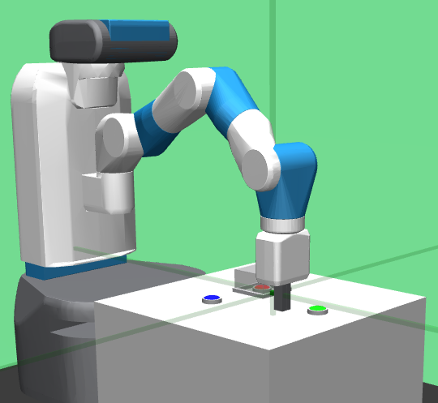
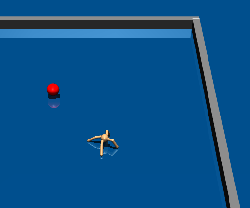
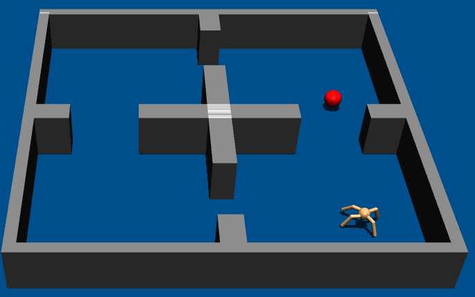
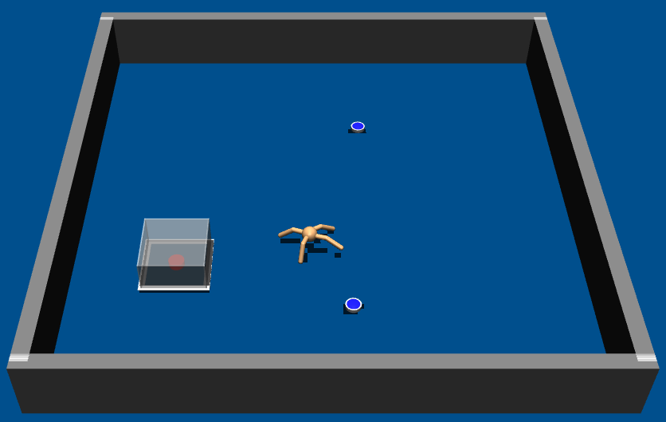
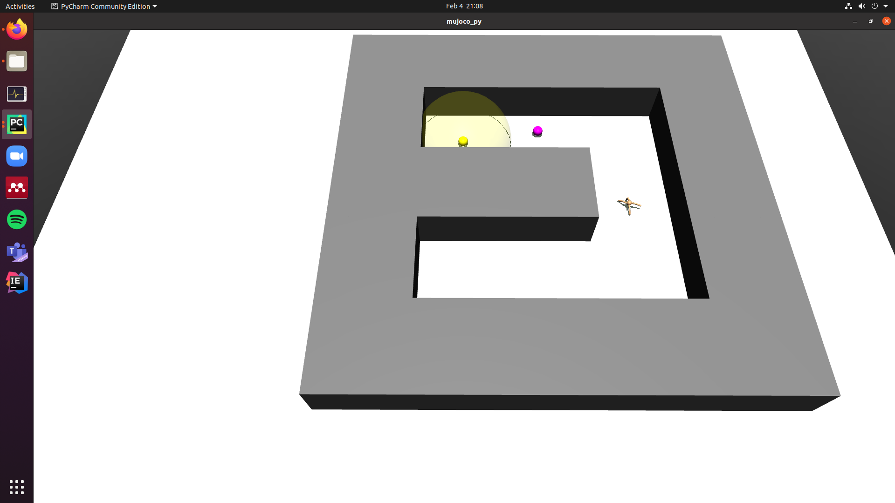
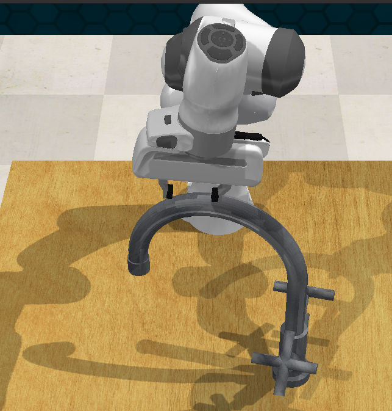

This page gives a short overview over the `custom_envs`.

# MuJoCo Environments

## Robotic Arm Environments
### Blocks

> Blocks-o2-gripper_random-v1

The _blocks_ environment directly inherits from the `gym.envs.robotics.fetch_env`. The basic task is to stack up to 4 blocks on top of each other. The number of blocks is configured with the number after the `o`. There are three configurations for the gripper-goal:
- `gripper_none`: The position of the gripper is not relevant for the goal
- `gripper_random`: The gripper should reach a random position after stacking the blocks
- `gripper_above`: The gripper should be above the stacked blocks

### Hook

> Hook-o1-v1

Basically the same as the _blocks_ environment, but the blocks can be out of reach and have to be pulled closer with a hook. Tool use! The gripper-goal is always `gripper_none`.

### ButtonUnlock

> ButtonUnlock-o2-v1

This time the goal is to push the red button. The robotic arm can only move in the x-y-plane. Before it can push the red button, it has to unlock access to it by pushing up to 2 blue buttons. In the picture, one button was already pressed. Causal Dependencies!

## Ant
We have a variety of _Ant_ environments that all inherit from `custom_envs.ant.ant_env`.
### AntReacher

> AntReacher-v1

The ant should reach the position marked with the red shpere.

### Ant Four Rooms

> Ant4Rooms-v1

The same as _AntReacher_, but with four rooms.

### AntButtonUnlock

> AntButtonUnlock-o2-v1

The same as _ButtonUnlock_ with the robotic arm, but with the Ant robot.

### AntMaze, AntPush and AntFall

> AntMaze-v0 

> AntPush-v0

> AntFall-v0

These environments were created to showcase the abilities of the [HIRO algorithm](https://arxiv.org/abs/1805.08296). We adapted them to fit in our framework. The goal of the Ant is to reach the yellow sphere (the purple sphere is a subgoal created by the HAC algorithm).

# CoppeliaSim
## RLBench

> turn_tap-state-v0

[RLBench](https://github.com/stepjam/RLBench) is a collection of ~100 environments, which we can use in our framework by wrapping them with our `custom_envs.wrappers.rl_bench_wrapper`. You can find a list of them in issue #66. Thoroughly tested RLBench environments are _reach_target-state-v0_, _turn_tap-state-v0_, _close_laptop_lid-state-v0_, _close_drawer-state-v0_ and _close_box-state-v0_.