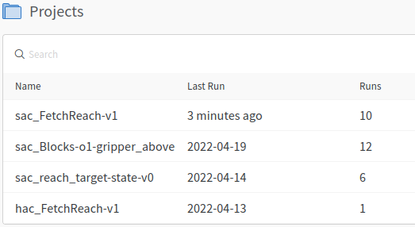
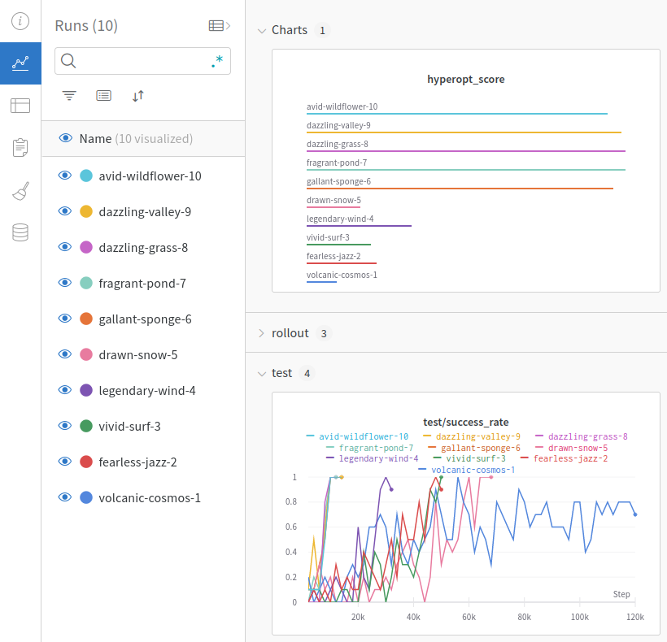
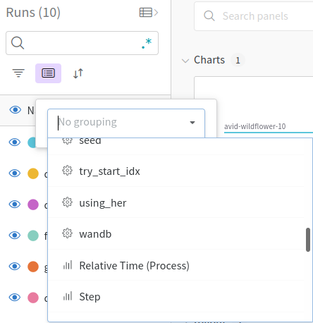
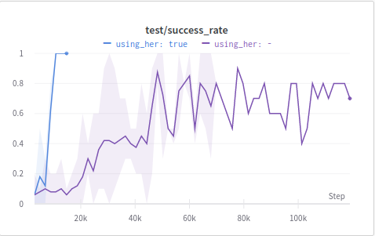
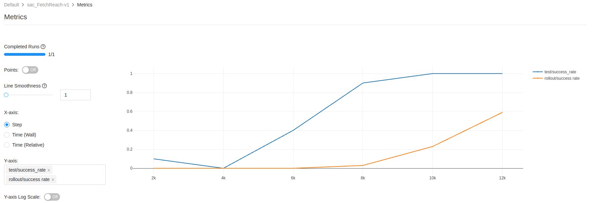

This tutorial shows you how to display logged data, e.g. `test/success_rate` (:warning: was meanwhile renamed to `eval/success_rate`), in MLFlow and in Weights and Biases. We recommend using Weights and Biases which is cloud-based, but MLFLow may be useful as a more lightweight alternative with local data storage. 

# Weights and Biases (WandB)

By default, WandB is enabled. To disable it, use `wandb=0`. WandB is a tool to track machine learning experiments. Here are the instruction from our readme on how to set it up:

- [Create an account](https://app.wandb.ai/login?signup=true)
- run `wandb login` in the console and paste your API key

After you ran at least one experiment with WandB, you can look at it on their website https://wandb.ai/YOUR_USERNAME/projects, or just click the link in the console output.
We set up the project so that Weights and Biases creates a _project_ for every environment-algorithm combination. Note that using hindsight experience replay (HER) does not influence the algorithm name, because it is just a special replay buffer.

Let's take a look at a project where we ran the FetchReach environment with SAC 10 times, 5 times without and 5 times with HER. It is important to run experiments multiple times (also way more than 5 times) because they are very dependent on random initializations. WandB gives all runs random names with the run number at the end, e.g. _volcanic-cosmos-1_. In our experiment, the first 5 runs were without HER and the last 5 runs were with HER. We can see the different metrics.

We can already see that the runs with HER perform better than those without. But with ten runs in one graph, it looks a little messy. Let's show only the means and min-max-range of the runs with and without HER. To do this, we group the runs by the parameter `using_her` by clicking on the _Group_ button (highlighted in purple) and choosing the `using_her` parameter.

And get a very clear result:

# MLFlow

Open a terminal in the Scilab-RL project and run `mlflow ui --host 0.0.0.0` to start an MLFlow server. The `--host` flag means that you can also access it from another computer which is convenient if you run your experiments on a remote computer. Now you can open MLFlow in your browser at http://0.0.0.0:5000/#/.

Your experiments are grouped. All experiments that are not run with multiprocessing are in the _Default_ group.

You can see how long ago your experiments started, how long they took and whether they finished :white_check_mark: or crashed :x:. You can also see the run name which is composed of the algorithm name and the environment name.

If you click on the start time of a run, you can inspect it in greater detail. You can look at the parameters, the metrics, and artifacts like the console outputs. You can also click on the metrics, to show how they changed over time. In the following example, the `rollout/success_rate` and `test/success_rate` are displayed. The x-axis shows the steps, because that is the most sensible option for reinforcement learning experiments. The run stopped after 12000 steps, because the early stopping threshold was reached. The `rollout/success_rate` is worse, because there are random perturbations during the rollout (for exploration and robustness) that are not present during the evaluation.

MLFlow works completely offline, in contrast to Weights and Biases which needs an internet connection. Weights and Biases however has more features like comparing or averaging runs.
