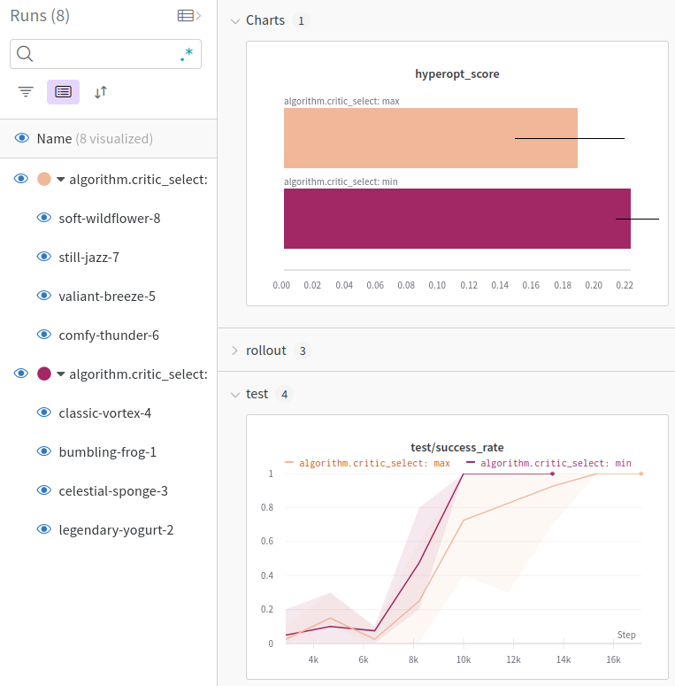

Hyperparameter optimization is essential for machine learning tasks. For our framework, we use Optuna for optimization and Weights and Biases to monitor the experiments. In this tutorial we take a look at how to configure the hyperparameter optimization.

We organize the configurations for hyperopt like this:
- all hyperopt configurations are stored in `conf/performance`
- they are in a folder which indicates the environment we are optimizing for, e.g. `conf/performance/Blocks`
- they end in `-opti.yaml` if they are configs for hyperopt and in `-test.yaml` if they are for [performance tests](Performance-tests).
- if there is a sub-type of the environment, e.g. the _Blocks_ env with one block and the gripper-goal above, this is reflected in the filename: `conf/performance/Blocks/o1-above-sac_her-opti.yaml`.

To learn about the hyperopt configuration, we create a config for the _FetchReach_ environment for the modified version of SAC, _SAC_MOD_, that we created in the [Create a copy of SAC and start modifying it tutorial](Adding-a-new-Algorithm).

## Configuration

At first we copy-paste the existing hyperopt config `conf/performance/FetchReach/sac_her-opti.yaml` into the same folder and name it `sac_mod-opti.yaml`. Let's go over the contents of the copied configuration and see what we have to adjust.

```
# @package _global_
# Changes specified in this config should be interpreted as relative to the _global_ package.
defaults:
  # access algorithm config group to get the default parameters of sac
  - override /algorithm: sac
```

Here we have to change `- override /algorithm: sac` to `- override /algorithm: sac_mod` to optimize for the sac_mod algorithm.

```
n_epochs: 10

env: 'FetchReach-v2'

algorithm:
  replay_buffer_class: HerReplayBuffer
  buffer_size: 1000000
  batch_size: 256
  policy_kwargs:
    net_arch:
      - 256
      - 256
      - 256
  replay_buffer_kwargs:
    n_sampled_goal: 4
    goal_selection_strategy: 'future'
    online_sampling: True
``` 
Delete `n_epochs: 10` because we would like to use the default `n_epochs=60` here.
The rest can be left as-is, because we still want to optimize for the FetchReach environment and use hindsight experience replay.

```
hydra:
  sweeper:
    study_name: sac_her_FetchReach
    max_trials: 32
    n_jobs: 8
    direction: maximize
    max_duration_minutes: 6000
    min_trials_per_param: 2
    max_trials_per_param: 3
    search_space:
      ++algorithm.learning_rate:
        type: float
        low: 0.0001
        high: 0.005
        log: true
      ++algorithm.gamma:
        type: float
        low: 0.9
        high: 0.99
        log: true
      ++algorithm.tau:
        type: float
        low: 0.005
        high: 0.1
        log: true
      ++algorithm.policy_kwargs.n_critics:
        type: int
        low: 1
        high: 4
```
This is the configuration for the sweeper that chooses the different parameterizations for the experiment runs. Let's go over the different settings:

- The most important thing to adjust is the `study_name`. Change it to _sac_mod_FetchReach_
- `max_trials` is the maximum number of runs, let's set it to 8 so that our experiment does not take too long
- `n_jobs` is the number of runs to run in parallel. It depends on how powerful the machine that you are running the experiments on is. For example, if you have a CPU with 4 threads, do not set `n_jobs` to anything higher than 3.
- `direction: maximize` tells the sweeper that we try to maximize a metric. In our case, this is the hyperopt-score that we return in `src/main.py` at the end of each experiment. The hyperopt-score is the sum of the mean of the evaluation metric (usually `eval/success_rate`) and the mean of the evaluation metric in the last `early_stop_last_n` epochs, divided by the number of epochs. In pseudo-python-code
```
score = mean(early_stop_data_column) + mean(early_stop_data_column[-early_stop_last_n:])
score /= epochs
```
- `max_duration_minutes` is the maximum runtime for the hyperopt in minutes. Let's set it to two hours, because it really should not take longer for only 8 trials
- `min_trials_per_param` and `max_trials_per_param` tells the sweeper how often each parameterization should be tested. For our experiment, we want each parameterization to be run exactly 4 times, so we set both to 4.
- in the `search_space`, we define the range of parameters that the sweeper should try. We only want to test the difference between using `algorithm.critic_select=min` and `algorithm.critic_select=max`. At first we remove the other four parameters. Then we add the following lines:
```
++algorithm.critic_select:
  type: categorical
  choices:
    - min
    - max
```
The type of this parameter is _categorical_, because we only have two options. Other types are _float_, e.g. for the `learning_rate`, or _int_, e.g. for something like `n_sampled_goal` ([learn more about types for the Optuna sweeper](https://hydra.cc/docs/plugins/optuna_sweeper/#configuring-through-config-file)). After the changes, the config should look like this:

```
# @package _global_
# Changes specified in this config should be interpreted as relative to the _global_ package.
defaults:
  # access algorithm config group to get the default parameters of sac
  - override /algorithm: sac_mod

# overwrite default parameters.
env: 'FetchReach-v2'

algorithm:
  replay_buffer_class: HerReplayBuffer
  buffer_size: 1000000
  batch_size: 256
  policy_kwargs:
    net_arch:
      - 256
      - 256
      - 256
  replay_buffer_kwargs:
    n_sampled_goal: 4
    goal_selection_strategy: 'future'
    online_sampling: True

hydra:
  sweeper:
    study_name: sac_mod_FetchReach
    max_trials: 8
    n_jobs: 4
    direction: maximize
    max_duration_minutes: 120
    min_trials_per_param: 4
    max_trials_per_param: 4
    search_space:
      ++algorithm.critic_select:
        type: categorical
        choices:
          - min
          - max

```

## Running the hyperopt

We can run the experiment with `python src/main.py +performance=FetchReach/sac_mod-opti --multirun`.
If everything goes well you should see something like
```
[2022-04-21 11:51:41,322][HYDRA] Launching jobs, sweep output dir : data/428cbb5/FetchReach-v2/11-51-41
[2022-04-21 11:51:41,322][HYDRA] 	#0 : ++algorithm.critic_select=min +performance=FetchReach/sac_mod-opti n_epochs=60
[2022-04-21 11:51:41,322][HYDRA] 	#1 : ++algorithm.critic_select=min +performance=FetchReach/sac_mod-opti n_epochs=60
[2022-04-21 11:51:41,322][HYDRA] 	#2 : ++algorithm.critic_select=min +performance=FetchReach/sac_mod-opti n_epochs=60
[2022-04-21 11:51:41,322][HYDRA] 	#3 : ++algorithm.critic_select=min +performance=FetchReach/sac_mod-opti n_epochs=60
```
On my computer with `n_jobs=4`, it took about 16 minutes for the hyperopt to finish. It determined `algorithm.critic_select=min` to be the better option:

```
[2022-04-21 12:07:02,134][HYDRA] Best parameters: {'++algorithm.critic_select': 'min'}
[2022-04-21 12:07:02,134][HYDRA] Best value: 0.24166666666666664
```

If we group the experiments in Weights and Biases ([how to](Display-logged-data)), we come to the same conclusion:



## Stopping the hyperopt

During hyperparameter optimization, we can stop the hyperopt after the next set of `n_jobs` finishes by deleting the file _delete_me_to_stop_hyperopt_. This makes it possible to stop the hyperopt while letting the current runs finish. The file is in the current working directory, which is usually the project root.
